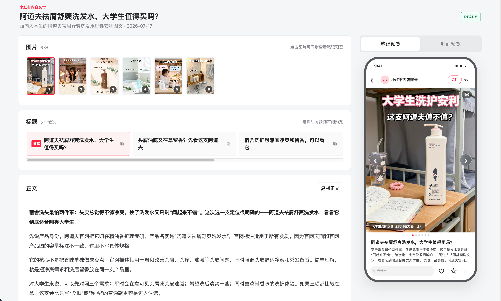

<p align="center">
  
</p>

<h1 align="center">小红书内容员工</h1>

<p align="center">
  面向个人创作者，把素材、选题、文案、多模型配图和 HTML 交付串成一条直接执行的小红书图文工作流。
</p>

<p align="center">
  ThinkAI · Codex / Claude Code / Hermes · 当前版本 <code>2.0.0</code>
</p>

## 效果预览

最终交付是一份可以直接打开和继续编辑的独立 HTML：上方整理图片，左侧
编辑候选标题和正文，右侧同步预览笔记与封面。




## 直接开始

把仓库链接和产品资料一起发给 Codex：

```text
请安装并使用“小红书内容员工”：
https://github.com/Shinchan-crayon/xiaohongshu-content-employee

根据我提供的资料制作一套小红书图文内容。第一次使用时先列出可用生图渠道
和具体模型供我选择并保存；选题确定后直接并发生图，图片返回后立即生成并
交付 HTML。
```

已经安装时，直接说：

```text
请使用 $xhs-content-employee，根据我提供的资料制作一套小红书图文内容。

内容目标：
产品或服务：
产品图片或素材链接：
已有文案：
参考内容：
目标用户：
账号语气：
```

资料不完整时，插件会在选题确定前使用可用搜索能力补充必要公开信息。

## 固定执行流程

`首次使用选择生图模型并保存 -> 选题已定 -> 一次生成文案和最终 Prompt -> Prompt 全批并发发送给所选模型 -> 图片返回 -> 立即生成 HTML -> 交付 HTML`

选题确定后不会再展示或复审 Prompt，也不会插入质检、安全审计、验图、截图、
浏览器预览、状态台账、自动重试或中途确认。所选模型返回部分图片时，直接使用
已经返回的图片生成 HTML；一张图片都没有返回时，直接反馈实际请求错误。

## 你会得到什么

- 可横向选择和继续编辑的候选标题
- 可继续编辑的小红书正文与标签
- 封面文案和最小必要轮播
- 所选图片模型全批并发生成的 3:4 配图
- 可切换图片、编辑标题正文、预览笔记与封面的独立 HTML

## 首次选择生图模型

第一次使用时，插件会先把下列渠道、具体模型和默认尺寸列给用户：

| 渠道 | 模型 | 默认竖版尺寸 |
| --- | --- | --- |
| ThinkAI Image 2 | `gpt-image-2` | `1536x2048` |
| ThinkAI Nano | `nano-banana-2` | `3:4@2K` |
| 火山引擎 Seedream | `doubao-seedream-5-0-lite-260128` | `1728x2304` |
| OpenAI GPT Image | `gpt-image-2` | `1024x1536` |
| Google Nano Banana | `gemini-3.1-flash-image` | `3:4@2K` |
| 其他渠道 | 用户自定义 | 用户自定义 |

用户选择并配置后，该项会保存为当前安装环境的默认生图模型。后续任务直接
复用，不再重复询问；只有用户明确要求切换时才重新选择。

也可以手动列出并配置：

```bash
python3 plugins/xiaohongshu-content-employee/scripts/生图工具/configure_provider.py --list
python3 plugins/xiaohongshu-content-employee/scripts/生图工具/configure_provider.py seedream
```

配置保存在插件目录的 `config.json`，该文件已被 Git 忽略，不会进入仓库。

## 安装

### Codex

在 Codex 对话中发送仓库链接并要求安装，或使用命令行：

```bash
codex plugin marketplace add Shinchan-crayon/xiaohongshu-content-employee --ref main
codex plugin add xiaohongshu-content-employee@xiaohongshu-content-employee
```

### Claude Code

```bash
claude plugin marketplace add Shinchan-crayon/xiaohongshu-content-employee
claude plugin install xiaohongshu-content-employee@xiaohongshu-content-employee
```

没有全局安装 Claude Code 时，可把命令中的 `claude` 换成
`npx -y @anthropic-ai/claude-code`。

### Hermes

克隆仓库后运行：

```bash
python3 plugins/xiaohongshu-content-employee/scripts/安装工具/install_skills.py --runtime hermes
```

安装器会安装同一套七个 Skill。已有同名 Skill 时默认不覆盖；确认升级时追加
`--force`。

## Skill 组成

| Skill | 作用 |
| --- | --- |
| `xhs-content-employee` | 唯一公开入口和直接执行编排 |
| `product-material-intake` | 整理产品事实与素材 |
| `xhs-research-strategy` | 补充必要公开信息并确定选题 |
| `xhs-copy-storyboard` | 生成标题、正文、标签和轮播 |
| `xhs-visual-planner` | 一次生成全部最终 Prompt |
| `xhs-approved-image-generator` | 使用首次选择的模型全批并发生图 |
| `xhs-html-delivery` | 图片返回后立即生成 HTML |

## 能力边界

- 不自动发布到小红书。
- 不保存用户的 API Key 到仓库。
- 不自动切换模型或图片渠道。
- 不为失败页面自动重试或补图。

## 开发者

ThinkAI
